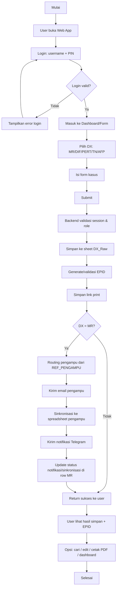
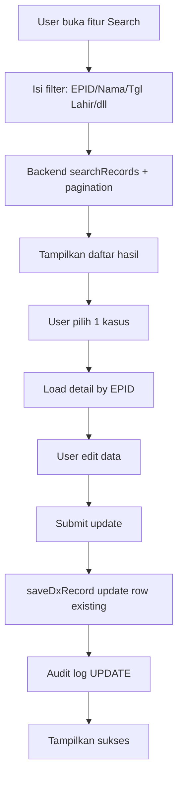
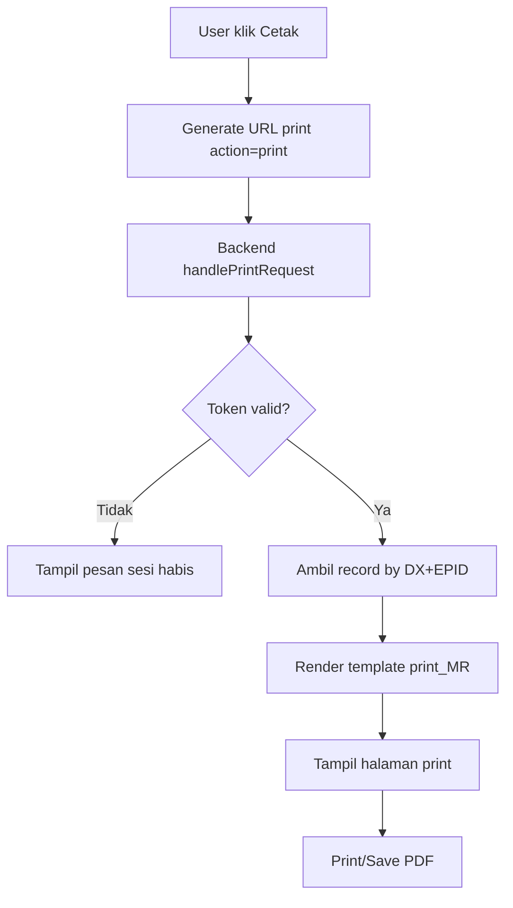
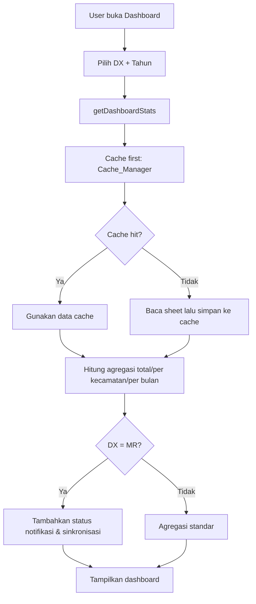

# Diagram Alur Pengguna

## 1) Alur Utama Pengguna (End-to-End)

## 2) Alur Pencarian & Edit Data

## 3) Alur Cetak PDF

## 4) Alur Dashboard

## 5) Ringkasan Role Pengguna
- **Admin**: full akses + setup config + audit log + retry batch.
- **Petugas**: input/edit data operasional.
- **Viewer**: baca/lihat data terbatas (tanpa aksi tulis tertentu).
